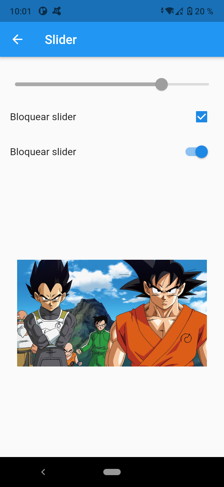

# Componentes de Flutter 

Proyecto desarrollado en Flutter que muestra algunos de los Widgets más usados en aplicaciones móviles.

## Capturas de pantalla

### Menú Principal

### Alertas

### Menú Principal

### Avatars

### Cards - Tarjetas

### Animated Container

### Inputs

### Sliders

### Listas y Scroll

