# Componentes de Flutter 

Proyecto desarrollado en Flutter que muestra algunos de los Widgets más usados en aplicaciones móviles.

## Capturas de pantalla

### Menú Principal

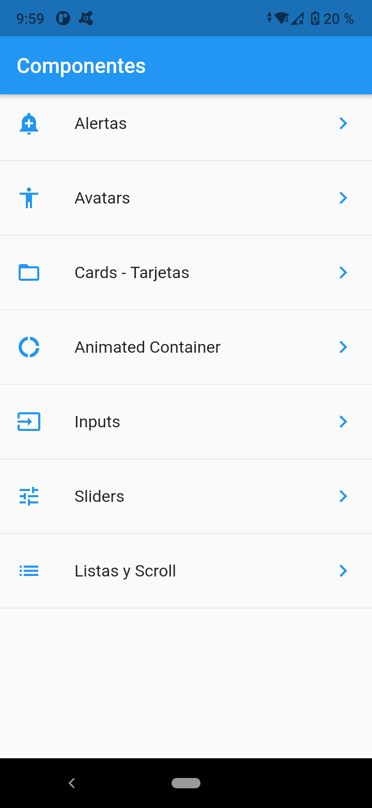

### Alertas

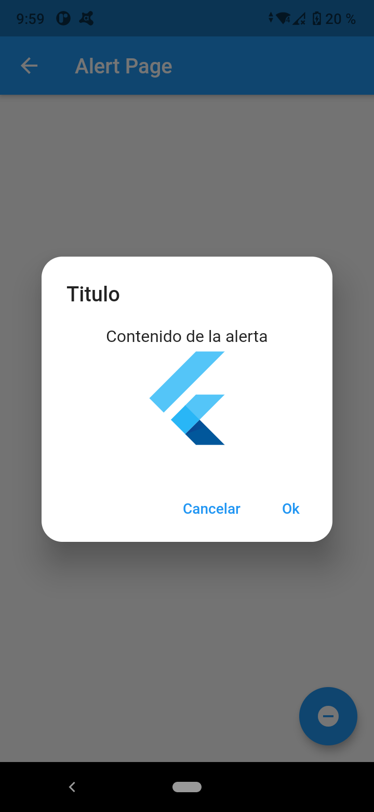

### Avatars

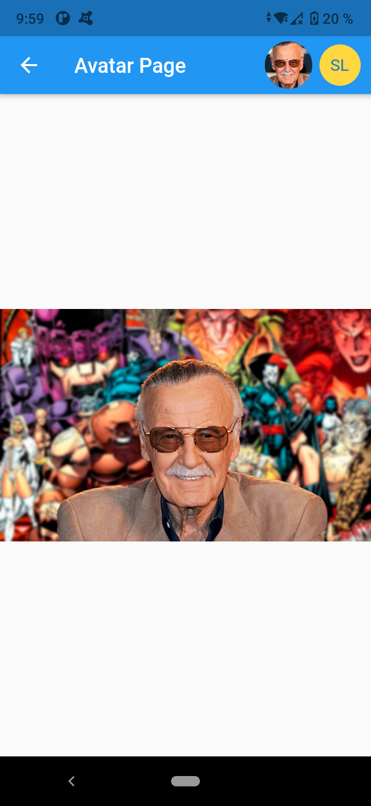

### Cards - Tarjetas

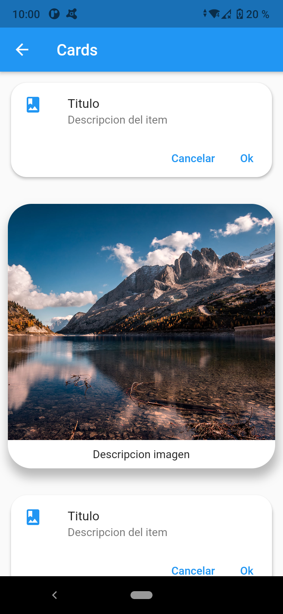

### Animated Container

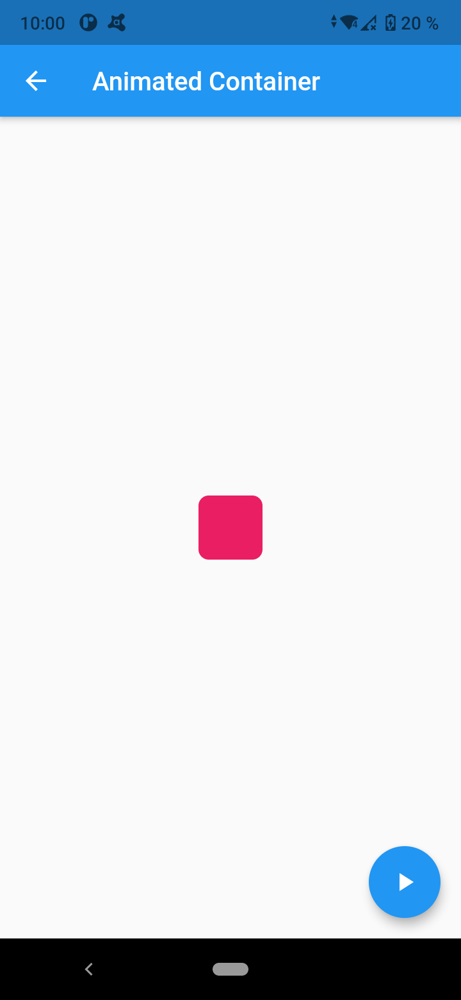

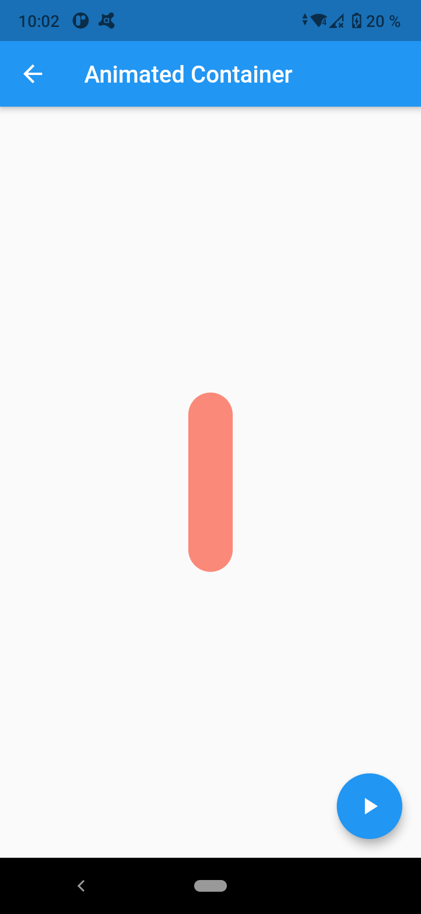

### Inputs

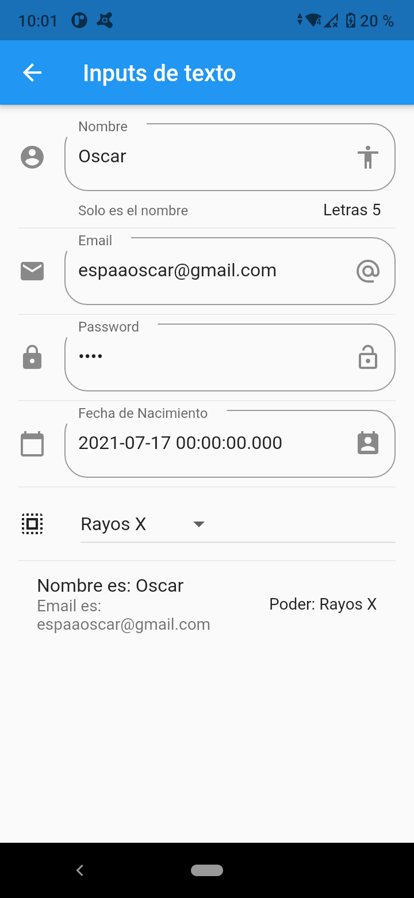

### Sliders

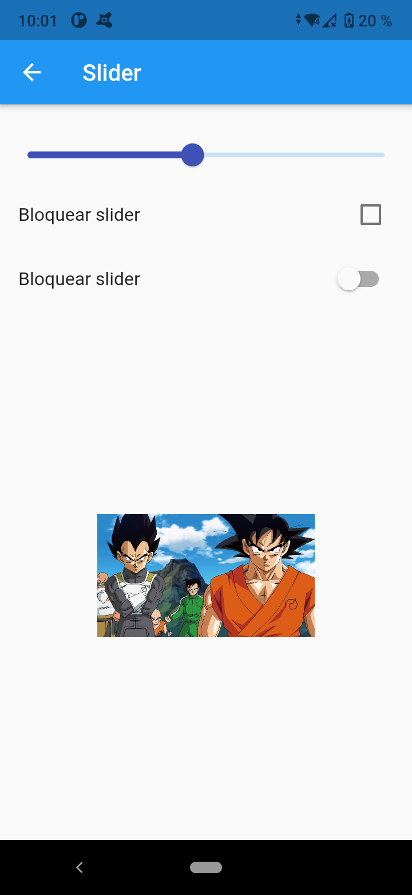

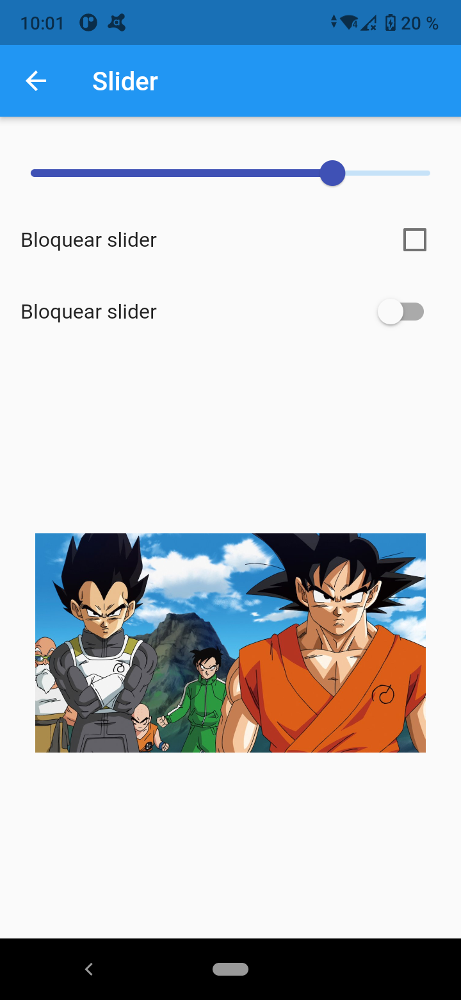

### Listas y Scroll

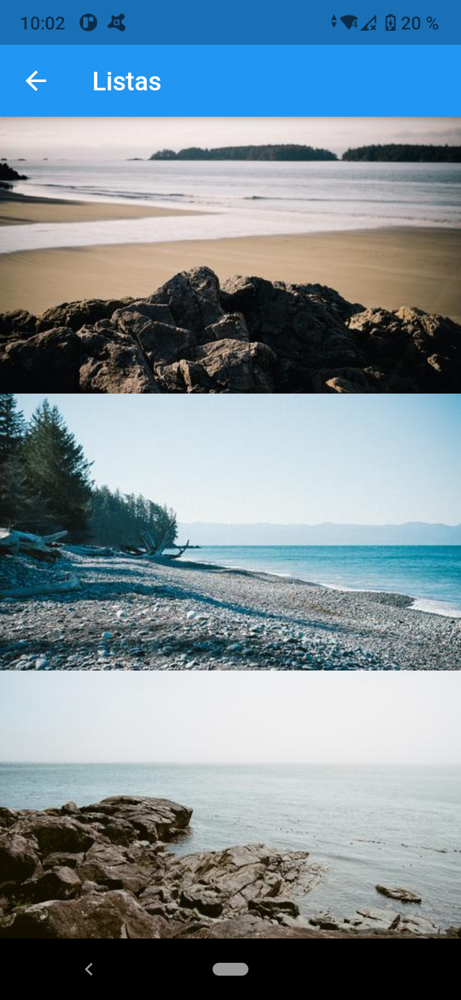

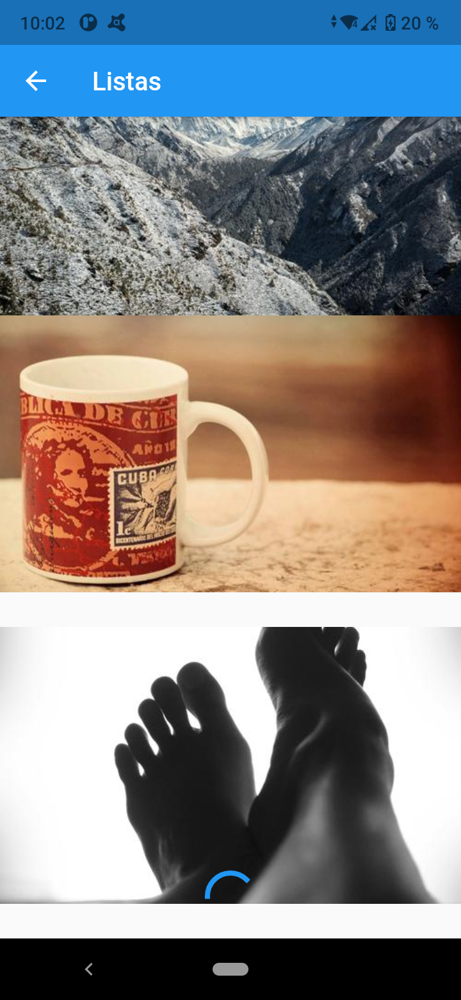